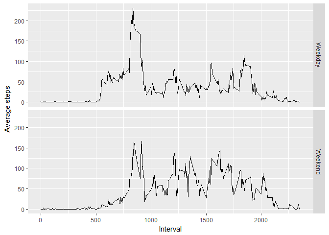

# Reproducible Research: Peer Assessment 1
Tim Steeman  


## Loading and preprocessing the data


```r
activity.dat = read_csv("activity.csv")
```

```
## Parsed with column specification:
## cols(
##   steps = col_integer(),
##   date = col_date(format = ""),
##   interval = col_integer()
## )
```


## What is mean total number of steps taken per day?


```r
activity.step.totals = activity.dat %>% filter(!is.na(steps)) %>% group_by(date) %>% summarise(total= sum(steps))
activity.step.totals %>% ggplot(aes(x=total)) +
    geom_histogram(binwidth = 500)
```

<!-- -->

```r
activity.step.totals.summary = summary(activity.step.totals$total)

options(scipen=999)
```

The mean of the total number of steps taken per day is: 10770 and the median is: 10760.


```r
activity.step.totals %>% ggplot(aes(x ="-" , y=total)) +
    geom_boxplot() +
    xlab("All days") +
    ylab("Total number of steps per day")
```

<!-- -->


## What is the average daily activity pattern?


```r
average.by.interval = activity.dat %>% filter(!is.na(steps)) %>%  group_by(interval) %>% summarise(averageSteps = mean(steps) )

plot(x=average.by.interval$interval,y=average.by.interval$averageSteps, type="l", xlab = "Interval", ylab="Average steps")
```

<!-- -->

```r
max.avg.steps = average.by.interval[which(average.by.interval$averageSteps == max(average.by.interval$averageSteps)),"interval"]
```
The interval for the maximum average number of steps is: 835 

## Imputing missing values


```r
totalmissing.rows = sum(!complete.cases(activity.dat))
```

Total number of rows with missing values: 2304.


```r
#get the indexes of rows that have na values for steps
indexes.with.nas = which(is.na(activity.dat$steps))
# get the associated interval numbers
intervals.with.na.values = activity.dat[indexes.with.nas,"interval"]

#use the interval numbers to index the data with the average steps for each interval to build a vector with average step values
vals = unlist(sapply(intervals.with.na.values$interval, function(x) average.by.interval[average.by.interval$interval==x,"averageSteps"]),use.names = FALSE)

# create a copy of the activity data
activity.no.na = activity.dat
#fill in the na values with average step values for each interval
activity.no.na[indexes.with.nas,"steps"] = vals
```

```r
activity.step.totals.complete = activity.no.na %>% group_by(date) %>% summarise(total= sum(steps))
activity.step.totals.complete %>% ggplot(aes(x=total)) +
    geom_histogram(binwidth = 500)
```

<!-- -->

```r
activity.step.totals.complete.summary = summary(activity.step.totals.complete$total)

options(scipen=999)
```

The mean of the total number of steps taken per day is: 10770 and the median is: 10770.

Totals median and frequencies of step counts are slightly higher. But not much has changed in the data.

## Are there differences in activity patterns between weekdays and weekends?


```r
activity.no.na$dayType = ifelse(weekdays(activity.no.na$date) %in% c("Saturday", "Sunday"),"Weekend", "Weekday")

byDayType = activity.no.na %>% group_by(dayType,interval) %>% summarise(avsteps = mean(steps))

byDayType %>% ggplot(aes(x=interval, y=avsteps)) +
    geom_line() +
    facet_grid(dayType~.) +
    xlab("Interval") +
    ylab("Average steps")
```

<!-- -->

